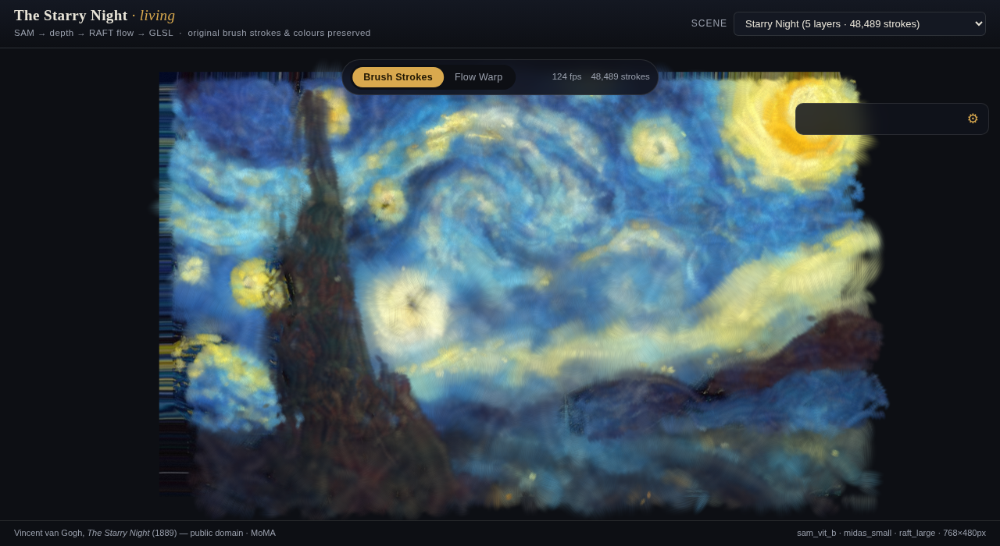
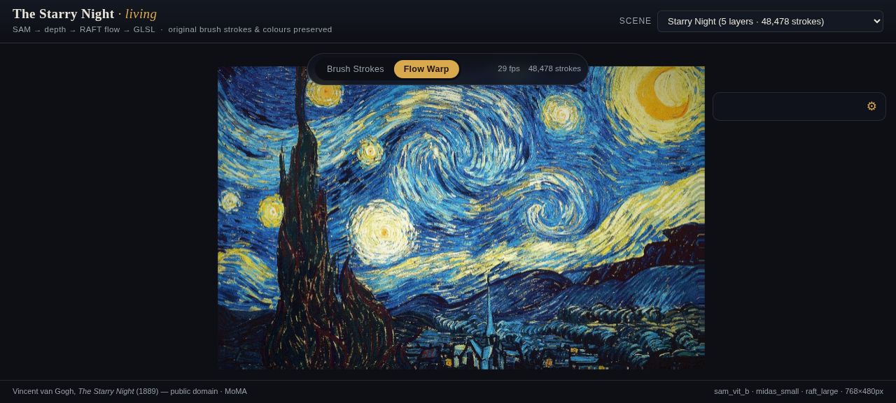

# Van Gogh Starry Night Demo 1

## What's new in this build

* **Grab bug fixed** — dragging no longer translates the whole painting as a
  flat image ( and no longer moved *against* the cursor ). The grab offset now
  drives **depth parallax**: the cypress, moon and stars glide with your hand
  while the far sky holds still, then the scene springs gently back home on
  release. Both render modes sample the base painting with a per-pixel depth
  offset, so the 2.5D feel is continuous everywhere.
* **Livelier animation** — stronger RAFT-flow advection with a wider pulse
  swing, breathing and gently wiggling dabs, livelier warp oscillation, and
  higher default flow / stroke-motion / speed / auto-pan values.
* **Prettier brush strokes** — almond-tapered impasto dabs with organic
  bristle bands, a warm motion-synced impasto ridge, darkened lower edges,
  and stroke data that now fades in and lifts off at the ends with
  per-stroke thickness jitter and denser seeding.

**SAM → depth → RAFT flow → GLSL**: a complete computer-vision pipeline that turns
*The Starry Night* into a living painting while **preserving Van Gogh's original
brush strokes and colours**. Every pixel colour in the final render is sampled
from the painting itself - all motion is purely geometric. No style transfer,
no repainting: the pipeline segments, measures, and *moves* the master's own paint.

```
                        ┌─────────────────────────────────────────────────┐
                        │                data/input/*.png                 │
                        └───────────────────────┬─────────────────────────┘
                                                │
   ┌────────────────────────────────────────────▼────────────────────────────────────┐
   │ 1. SAM ( ViT-H / ViT-B )  automatic mask generation                             │
   │    + HSV / geometry / position priors  →  semantic RGBA layers                   │
   │      sky · mountains · village · tree · stars · moon                             │
   ├──────────────────────────────────────────────────────────────────────────────────┤
   │ 2. ZoeDepth-NK  ( fallback: MiDaS-small )  monocular depth                      │
   │    → relative depth map ( near = 1 ) + per-layer median depth                   │
   ├──────────────────────────────────────────────────────────────────────────────────┤
   │ 3. RAFT-large ( torchvision, pretrained )                                       │
   │    × depth-synthesised parallax pair ( synthetic camera translation )           │
   │    → dense optical flow, the "living paint" motion field                        │
   ├──────────────────────────────────────────────────────────────────────────────────┤
   │ 4. Hertzmann curved brush strokes ( 1998 )                                      │
   │    per-layer brush radii, strokes follow iso-luminance contours                 │
   │    → ~48 k GPU-instanced stroke segments, colours sampled from the painting     │
   ├──────────────────────────────────────────────────────────────────────────────────┤
   │ 5. export → renderer/web/assets   ( WebGL 2 + GLSL ES 300 )                     │
   └──────────────────────────────────────────────────────────────────────────────────┘
                                                │
                        ┌───────────────────────▼─────────────────────────┐
                        │   renderer/web/index.html - dual-mode viewer    │
                        │   [ Brush Strokes ]  [ Flow Warp ]  + controls  │
                        └─────────────────────────────────────────────────┘
```

## The four CV methods

| stage | model / method | reference |
|-------|----------------|-----------|
| semantic layers | **Segment Anything** ( automatic mask generation ) + classical HSV/geometry priors + HSV blob-assist for stars & moon | Kirillov et al., *Segment Anything*, ICCV 2023 |
| depth | **ZoeD_NK** metric depth via `torch.hub`, MiDaS-small fallback on CPU / low RAM | Bhat et al., *ZoeDepth*, CVPR 2023 · Ranftl et al., *MiDaS*, TPAMI 2022 |
| optical flow | **RAFT-large** ( official torchvision implementation, pretrained weights ) on a depth-synthesised parallax pair - the painterly-animation technique of *flow-driven stroke advection* | Teed & Deng, *RAFT*, ECCV 2020 · Hays & Essa 2007 · O'Donovan & Hertzmann 2014 |
| painterly rendering | **curved brush strokes of different sizes**, coarse-to-fine radii per semantic layer, stroke direction ⟂ image gradient ( iso-contour following ), colour preservation by construction | Hertzmann, *Painterly Rendering with Curved Brush Strokes of Different Sizes*, SIGGRAPH 1998 |

## Quickstart

```bash
# 1. install ( CPU wheels are fine - add --index-url for CUDA builds if you have a GPU )
python -m pip install -r requirements.txt

# 2. fetch model checkpoints ( SAM ViT-B by default; PROFILE=paper for ViT-H 2.4 GB )
./scripts/download_models.sh          # or: python scripts/download_models.py --profile cpu

# 3. run the full pipeline on every image in data/input/
python -m inference.run_pipeline      # add --profile paper --device cuda for top quality

# 4. view the live renderer
python scripts/serve.py               # → http://127.0.0.1:8899
```

`data/input/` ships two demo images: the painting itself
(`starry_night.png`, public domain) and a deterministic synthetic stand-in
(`starry_night_synthetic.png`, regenerable via `scripts/make_synthetic.py`)
so the demo works fully offline.

## Model profiles

| profile | SAM | depth | flow | RAM | notes |
|---------|-----|-------|------|-----|-------|
| `paper` | ViT-H ( 2.4 GB ) | ZoeD_NK | RAFT-large | ~8 GB | best masks & metric depth; GPU recommended |
| `cpu`   | ViT-B ( 375 MB ) | MiDaS-small | RAFT-large | ~2 GB | runs end-to-end on 2 CPU cores in ~45 s / scene |
| `auto`  | ViT-H if CUDA else ViT-B | ZoeD if resources else MiDaS | RAFT-large | - | default |

Robustness chain ( every stage degrades gracefully and says so in the log ):
`SAM ViT-H → ViT-B → ViT-L → classical Lab-k-means segmentation`,
`ZoeD_NK → MiDaS_small`, `RAFT-large → RAFT-small → analytic depth-parallax flow`.

## CLI

```
python -m inference.run_pipeline [OPTIONS]

  --input PATH[:SCENE] ...   inputs ( default: all images in data/input/ )
  --profile {paper,cpu,auto} model profile ( default: auto )
  --device {auto,cuda,mps,cpu}
  --max-side N               processing resolution, longest side ( default 768 )
  --points-per-side N        SAM point-grid density ( auto: 32 GPU / 16 CPU )
  --labels {auto,generic}    starry-night priors or positional generic layers
  --stages LIST              comma list from: sam,depth,flow,strokes,export or all
  --max-segments N           brush-stroke budget per scene ( default 48000 )
  --output-root DIR          intermediates ( default outputs/ )
  --web-root DIR             renderer assets ( default renderer/web/assets )
  --force                    rerun stages even if cached
  --no-download              never auto-download checkpoints
```

Every stage is **cached** - a JSON manifest per stage gates re-execution, so
reruns resume instantly and `--stages strokes,export --force` rebuilds only
what you asked for.

## Outputs

```
outputs/<scene>/
  input.png                 canonical resized working copy
  layers/<name>.png         RGBA semantic layers ( RGB = original pixels )
  layers.json               paint order, per-layer stats, engine
  depth/depth.npy           float32 relative depth ( near = 1 )
  depth/depth_smooth.npy    median + gaussian smoothed
  depth/depth.png           8-bit depth for the renderer
  depth/depth_viz.png       turbo colormap preview
  flow/flow.npy             ( H, W, 2 ) float32 px
  flow/flow.flo             Middlebury format ( standard flow tooling )
  flow/flow.png             invertible 8-bit RGB flow codec ( WebGL )
  flow/flow_viz.png         Middlebury colour-wheel preview
  flow/parallax_pair.png    the synthetic second frame RAFT was fed
  strokes/strokes.bin       float32 records, stride 12 ( see brush.vert )
  report.json               per-stage timings + engines used
renderer/web/assets/<scene>/   the shipped web bundle ( manifest.json + all of
                               the above in renderer-friendly layout )
```

## The WebGL renderer




Two render modes over the same asset bundle ( toggle in the UI or press `1` / `2` ):

* **Brush Strokes** - ~48 k GPU-instanced brush dabs. The vertex shader advects
  each segment along its local RAFT flow vector with layered sinusoids
  ( periodic → drift-free ), adds layer-depth parallax and a subtle
  "breathing" of the brush width; the fragment shader draws an impasto-style
  dab with bristle streaks. Colours come from the stroke records - sampled
  from the painting at extraction time.
* **Flow Warp** - the semantic RGBA layers composited back-to-front, each
  sampled with its own depth-scaled parallax offset plus a flow-driven
  oscillation. The full-screen composite shader is
  `renderer/shaders/depth_parallax.frag` ( `optical_flow.frag` provides the
  motion library, `common.glsl` the shared noise / flow-decode helpers ).

Controls: drag = depth parallax ( near layers glide, the sky holds; springs
back on release ) · wheel = zoom · mouse-move = micro parallax ·
sliders for parallax / flow strength / stroke motion / speed / brush size /
auto-pan · `space` pause · `r` reset · `s` save PNG · `h` hide panel.
Scene switcher in the top bar. WebGL2 is required; otherwise the page falls
back to the original image with an explanation.

## Deploying

The renderer is 100 % static - point Netlify at the repo ( `netlify.toml`
publishes `renderer/web` ) or any static host:

```bash
python scripts/serve.py --port 8899        # local, no-cache dev server
cd renderer/web && python -m http.server   # quick alternative
```

## Tests

```bash
python -m pytest tests/      # 28 tests, no model downloads, ~12 s
```

Coverage: flow codec roundtrips ( PNG + Middlebury `.flo` ), semantic
labelling heuristics on synthetic fixtures, layer-stack coverage & paint
order, depth normalisation & smoothing ( models monkeypatched ), parallax
pair synthesis, RAFT output rescaling, painterly record layout **pinned
against the shader attribute order**, per-layer stroke budgets, colour
preservation, and the full web-export manifest / registry / shader sync.

## Project structure

```
inference/
  run_pipeline.py    CLI orchestrator ( argparse, caching, timing, reports )
  sam_segment.py     SAM + semantic priors + blob assist + classical fallback
  depth_estimate.py  ZoeDepth / MiDaS via torch.hub ( offline-friendly loader )
  optical_flow.py    RAFT + depth-parallax pair synthesis + analytic fallback
  painterly.py       Hertzmann curved strokes -> strokes.bin ( stride 12 )
  export_web.py      asset bundle, manifest, scene registry, shader sync
  flow_codec.py      PNG codec ( mirrors optical_flow.frag ), .flo, colour wheel
  model_zoo.py       checkpoint discovery / resumable downloads
  utils.py           logging, image IO, JSON, device, timing
renderer/
  shaders/           GLSL ES 300 sources ( synced into web/shaders at export )
  web/               index.html, main.js, style.css + exported assets/
scripts/
  download_models.py resumable SAM downloads + torch.hub warmup
  make_synthetic.py  deterministic offline test painting
  serve.py           no-cache dev server with GLSL MIME types
tests/               pytest suite ( 28 tests )
data/input/          starry_night.png + starry_night_synthetic.png
```

## Performance

Measured on 2 CPU cores / 4 GB RAM, 768-px long side, `cpu` profile:
SAM ViT-B 30 s · MiDaS 0.2 s · RAFT-large 4 s · strokes 2 s · export 0.1 s
→ **~45 s per scene**. The renderer sustains hundreds of fps for 48 k
instanced strokes on integrated GPUs ( verified in headless Chromium ).

## Known limitations

* SAM is class-agnostic: semantic names come from *Starry Night* priors;
  on other paintings use `--labels generic` ( positional layering ).
* MiDaS-small depth on a flat painting is plausible, not metric; use the
  `paper` profile ( ZoeD_NK ) for research-grade depth.
* Optical flow needs two frames - we synthesise the second one from depth
  ( camera translation ), so the flow field encodes *parallax motion*,
  which is exactly what the renderer animates.

## Credits & licences

* Vincent van Gogh, *The Starry Night* ( 1889 ) - public domain ( MoMA ).
* SAM ( Apache-2.0 ) · ZoeDepth ( MIT ) · MiDaS ( MIT ) · RAFT ( BSD-3 ).
* This project's code: MIT.
