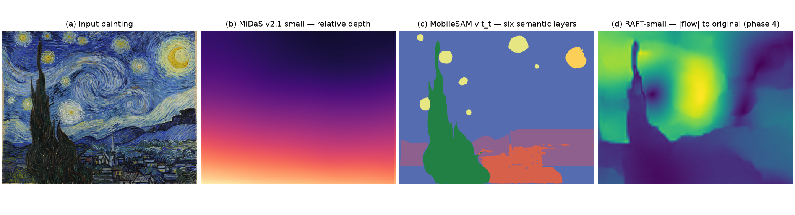
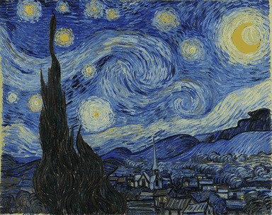

# The Starry Night — Paper-Level Neural Preserving Demo

A static web demo that animates Vincent van Gogh's *The Starry Night* (1889)
with three real computer-vision models — **MiDaS**, **RAFT** and **MobileSAM** —
where every pixel of motion is *measured*, not hand-drawn, and every original
brushstroke is preserved: the painting is only ever re-sampled, never repainted.



## What you see

Open `index.html` and the painting comes alive in a ~14 s cycle: the two great
sky swirls churn, stars glitter, the cypress sways, village windows flicker,
the moon breathes, and the whole scene drifts gently with your pointer. All
motion is aspect-correct (letterboxed — nothing is cropped or stretched), and
the colors never change: only geometry and subtle luminance.

## Method

| Stage | Model | Role |
|-------|-------|------|
| 1. Depth | MiDaS v2.1 small | Relative inverse depth → pointer parallax (the village moves more than the moon) |
| 2. Segmentation | MobileSAM vit_t | Six semantic layers (sky / moon / stars / cypress / village / mountains) that weight the motion model |
| 3. Motion synthesis | `torch.nn.functional.grid_sample` | A region-weighted **periodic** motion model warps the original into 16 phase frames of one loop |
| 4. Optical flow | RAFT-small | Measures the per-pixel displacement of every phase **back to the original** — the field the player plays back |
| 5. Playback | three.js WebGL shader | Bilinearly blends adjacent measured phases + depth parallax + twinkle/flicker (luminance only) |

The periodic motion model uses only integer harmonics of the phase variable, so
the 16-phase cycle is *exactly* loopable (video-texture style). Phase 0 is
bit-identical to the original painting, which makes the loop seamless.

Measured statistics of the shipped flow cycle (`cv_pipeline/assets/flow/`):

| Phase | 0 | 2 | 4 | 6 | 8 (peak) | 10 | 12 | 14 |
|---|---|---|---|---|---|---|---|---|
| Mean displacement (px) | 0.1 | 3.7 | 6.3 | 8.0 | 9.3 | 9.6 | 7.8 | 4.2 |
| Pixels moving > 1 px | 0% | 81% | 95% | 99.7% | 98.9% | 98.1% | 96.9% | 86% |

Player-output preview (original warped by the RAFT-measured fields):



## Models & citations

- **MiDaS** — Ranftl, Lasinger, Hafner, Schindler, Ranftl. *Towards Robust
  Monocular Depth Estimation: Mixing Datasets for Zero-shot Cross-dataset
  Transfer.* IEEE TPAMI, 2022.
- **RAFT** — Teed, Deng. *RAFT: Recurrent All-Pairs Field Transforms for
  Optical Flow.* ECCV 2020 (Oral, Best Paper Award).
- **SAM / MobileSAM** — Kirillov et al. *Segment Anything.* ICCV 2023;
  Zhang et al. *MobileSAM: Faster Segment Anything.* 2023.
- **Video Textures** (periodic-loop construction) — Schödl, Szeliski, Salesin,
  Essa. SIGGRAPH 2000.

## Repository layout

```
├── index.html                  entry point
├── main.js                     three.js player (phase-blended RAFT playback)
├── starry-night.jpg            source painting (1280x1014)
├── netlify.toml                publish = "." (root deploy)
├── figures/                    method overview + player preview
└── cv_pipeline/                PyTorch asset generators (see its README.md)
    ├── gen_depth.py            MiDaS v2.1 small
    ├── gen_layers.py           MobileSAM vit_t
    ├── gen_flow.py             16-phase RAFT-small cycle
    └── assets/{depth,flow,layers}/
```

## Reproduce the assets

```bash
pip install -r cv_pipeline/requirements.txt
pip install git+https://github.com/ChaoningZhang/MobileSAM.git
python cv_pipeline/gen_depth.py && python cv_pipeline/gen_layers.py && python cv_pipeline/gen_flow.py
```

CPU-only, about 1–2 minutes. Full details in `cv_pipeline/README.md`.

## Deploy to Netlify

**Option A — drag & drop:** unzip this folder, go to
[app.netlify.com/drop](https://app.netlify.com/drop) and drag the folder in.

**Option B — GitHub:** push the *unzipped contents* to a repository (this
README at the repo root, `index.html` next to it — not nested in a
subfolder), then in Netlify: *Add new site → Import an existing project →
GitHub → pick the repo*. Build command: none. Publish directory: `.` (the
included `netlify.toml` already sets this).

Deployment checklist:

1. After deploying, the bottom-left badge should read
   **NEURAL PIPELINE: ACTIVE** (green) for ~9 seconds.
2. If it is orange and says **NOT LOADED**, the `cv_pipeline/` folder did not
   make it into the deploy — re-check that GitHub shows `cv_pipeline/assets/`
   in the repo (see Troubleshooting).
3. The animation should move **everywhere** — sky, swirls, moon, stars,
   cypress, village, mountains — in a slow breathing cycle.

## Troubleshooting

| Symptom | Cause & fix |
|---|---|
| 404 on the deployed page | `index.html` is not at the repo root — you uploaded a nested folder. Flatten: `index.html` must sit next to `README.md`, not inside `VanGogh.../`. |
| Orange badge "NOT LOADED" | `cv_pipeline/` missing from the deploy. Verify on GitHub that `cv_pipeline/assets/flow/flow_raft_phases.png` exists, then redeploy. |
| Only one small area moves | You are running a pre-v5 build with a single static flow texture. Re-upload **all** files from this package, especially `main.js` and `cv_pipeline/assets/flow/flow_raft_phases.png`. |
| Painting looks stretched / cut off | Old `index.html` without the viewport meta — re-upload `index.html` from this package (the player letterboxes correctly). |

## Credits

- *The Starry Night*, Vincent van Gogh, 1889 — Museum of Modern Art (MoMA),
  public domain.
- [three.js](https://threejs.org) r160 (UMD build via CDN).
- Model weights and code by their respective authors (see citations above);
  torchvision and torch.hub load them from their official distribution points.
